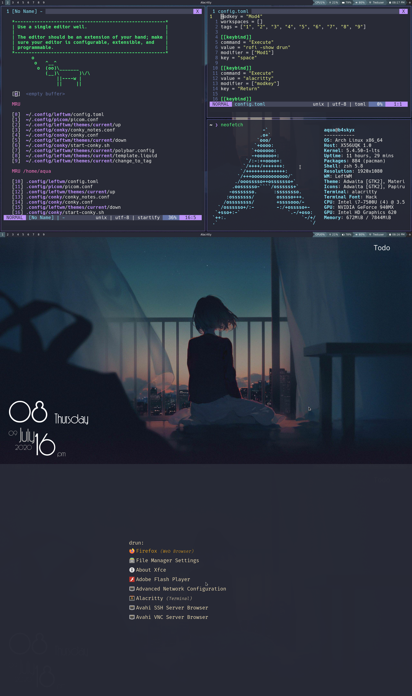

# Soothe: A leftwm configured theme

If you're here, you would obviously want to know how it looks.


## Configuration:

```
DE          : Arch
WM          : Leftwm
terminal    : Alacritty
colorscheme : Dracula
bar         : Polybar
Launcher    : Rofi
```
## Installation

Clone this repo to get started.

```
git clone https://github.com/b4skyx/leftwm-soothe.git
cd leftwm-soothe
```

You would want to have the fonts installed first, so that everything is rendered correctly.
To do so
```
cp -r .fonts/* ~/.fonts/
```

To use the this theme, symlink the theme folder to your current leftwm theme
```
ln -s $PWD/theme $HOME/.config/leftwm/themes/current
```

Application specific themes such as rofi can be configured manually. Refer to their man pages in detail.
Usually their specific configuration can be found in ``.config`` directory.
